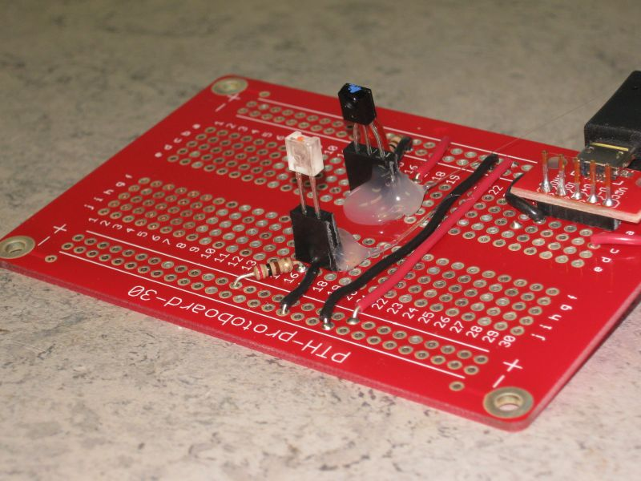
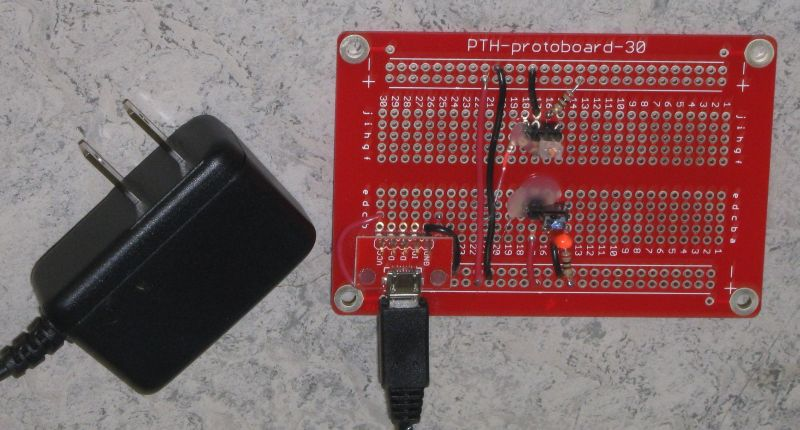
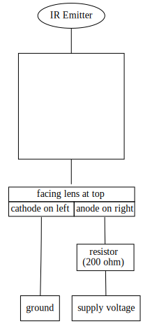

# IR Test Jig

The test jig is intended to be used to test both components:

* [IR Emitter QEE123](https://media.digikey.com/pdf/Data%20Sheets/ON%20Semiconductor%20PDFs/QEE122_123.pdf)
* [IR Sensor QSE159](https://www.onsemi.com/pub/Collateral/QSE159-D.pdf)

